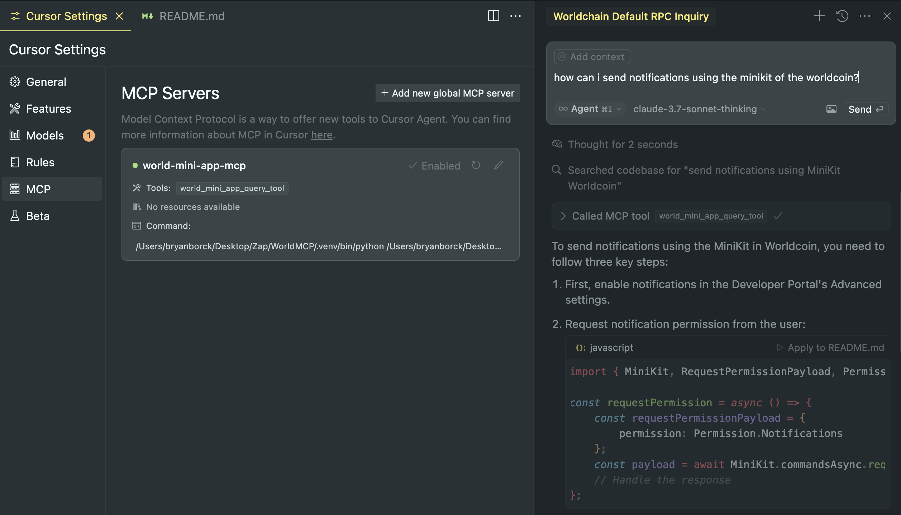
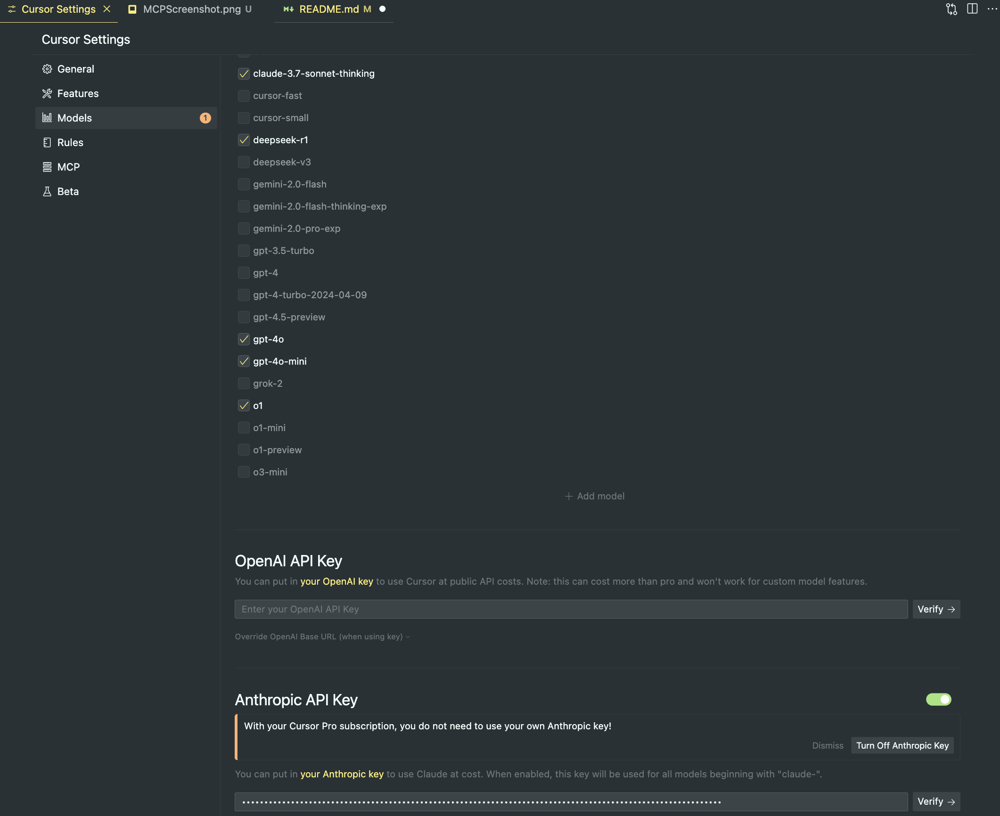

# World MiniApps MCP Server with Cursor

This project sets up an MCP server to query World Mini Apps docs and integrates it with Cursor.

## Idea

The idea is to have an agent capable to read the [MiniApps](https://docs.world.org/mini-apps) Documentation, and thenn help you code your world MiniApp with Cursor.

## Prerequisites

- **Python 3**: Download from [python.org](https://www.python.org/downloads/) or install via Homebrew:
  ```bash
  brew install python
  ```
- **Cursor**: Installed on your system.

## Setup Instructions

### 1. Setup Your Python Environment

Open your terminal and run these commands:

```bash
# Create a virtual environment
python3 -m venv .venv

# Activate the virtual environment
source .venv/bin/activate
```

### 2. Install Dependencies

With your virtual environment activated, install the required packages:

```bash
pip install langchain_community langchain-openai langchain-anthropic scikit-learn bs4 pandas pyarrow matplotlib lxml langgraph "mcp[cli]" tiktoken
```

### 3. Build the Documentation Vector Store

Before running the build script, export your OpenAI API key in the terminal:

```bash
export OPENAI_API_KEY="your-openai-api-key"
```

Then, run:

```bash
python3 worldMiniApp-MCP/miniApp_build_docs.py
```

Obs.: Mateo (World Team) said that you can use [https://docs.world.org/llms-full.txt](https://docs.world.org/llms-full.txt) for all World Docs support.

This script will create `llms_full.txt` and `sklearn_vectorstore.parquet`.

### 4. Run the MCP Server

Start your MCP server by running:

```bash
python3 worldMiniApp-MCP/miniApp_mcp.py
```

The server runs over stdio and waits for MCP requests.

### 5. Configure Cursor to Use Your MCP Server

1. **Open Cursor Settings**:

   - In Cursor, go to Settings and click the MCP tab.

2. **Activate MCP and Add Configuration**:
   - Copy and paste the JSON below into the MCP configuration area:

```json
{
  "mcpServers": {
    "world-mini-app-mcp": {
      "command": "your-absolute-path-to-repo-folder/WorldMCP/.venv/bin/python",
      "args": [
        "your-absolute-path-to-repo-folder/WorldMCP/worldMiniApp-MCP/miniApp_mcp.py"
      ],
      "env": {
        "OPENAI_API_KEY": "sk-xxxxxxxxxxxxxxxxxxxx"
      }
    }
  }
}
```

- Replace `"your-openai-api-key"` with your actual API key.

3. **Save the Configuration**:
   - Cursor will now detect your MCP server.

Image support for the 3 steps:



### 6. Chat with the MCP Agent in Cursor

- **Switch to Agent Mode**:
  - Instead of standard chat, activate Agent mode in Cursor.
- When you chat, Cursor will use your MCP tool (world_mini_app_query_tool) to fetch World MiniApp documentation as needed.

1. **Remember to use Claude Sonnet**

   - specially the model "claude-3.7-sonnet-thinking"

2. **Get API Key from Anthropic**:

   - Go to [https://console.anthropic.com/](https://console.anthropic.com/)
   - Create a Profile
   - Get an API Key putting credit, 10 USD is a good amount to test and use for build your miniApp (remembers Claude 3.7 has more token usege)

3. **Open Cursor Settings**:

   - In Cursor, go to Settings and click the Models tab.
   - Select the Claude model
   - Put your Anthtopic API Key

Image support for the 3 steps:



## (Optional) Test with MCP Inspector

To manually inspect your MCP server, install and run MCP Inspector:

```bash
npm install -g @modelcontextprotocol/inspector
mcp-inspector
```
